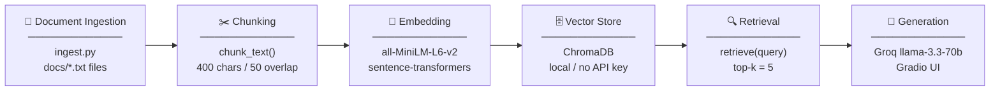

# Project 1 Planning: The Unofficial Guide

## Domain

Student reviews of CS professors at Rutgers University - New Brunswick. This knowledge is valuable because official course descriptions say nothing about teaching style, exam difficulty, grading fairness, or workload. Students rely on word-of-mouth and Rate My Professors to make informed scheduling decisions, but that information is scattered across individual professor pages and hard to query across multiple professors at once.

---

## Documents

| # | Source | Description | URL or location |
|---|--------|-------------|-----------------|
| 1 | Rate My Professors | Student reviews for Professor Abraham Gale (CS205, CS336, DS142) | https://www.ratemyprofessors.com/professor/2814183 → docs/abraham_gale.txt |
| 2 | Rate My Professors | Student reviews for Professor Ana Centeno (CS111, CS112) | https://www.ratemyprofessors.com/professor/600296 → docs/ana_centeno.txt |
| 3 | Rate My Professors | Student reviews for Professor Sesh Venugopal (CS210, CS213) | https://www.ratemyprofessors.com/professor/182646 → docs/sesh_venugopal.txt |
| 4 | Rate My Professors | Student reviews for Professor David Menendez (CS211, CS214, CS314) | https://www.ratemyprofessors.com/professor/2336289 → docs/david_menendez.txt |
| 5 | Rate My Professors | Student reviews for Professor Ananda Gunawardena (CS205, CS210, CS439) | https://www.ratemyprofessors.com/professor/2414859 → docs/ananda_gunawardena.txt |
| 6 | Rate My Professors | Student reviews for Professor Samaneh Hamidi (CS205, CS206, CS344) | https://www.ratemyprofessors.com/professor/2519830 → docs/samaneh_hamidi.txt |
| 7 | Rate My Professors | Student reviews for Professor Tomasz Imielinski (CS142, CS336) | https://www.ratemyprofessors.com/professor/1580600 → docs/tomasz_imielinski.txt |
| 8 | Rate My Professors | Student reviews for Professor Bernhard Firner (CS211, CS462) | https://www.ratemyprofessors.com/professor/1916642 → docs/bernhard_firner.txt |
| 9 | Rate My Professors | Student reviews for Professor Minesh Patel (CS211) | https://www.ratemyprofessors.com/professor/2980565 → docs/minesh_patel.txt |
| 10 | Rate My Professors | Student reviews for Professor Miranda Garcia (CS112, CS205, CS336) | https://www.ratemyprofessors.com/professor/2702069 → docs/miranda_garcia.txt |

---

## Chunking Strategy

**Chunk size:** 400 characters

**Overlap:** 50 characters

**Reasoning:** Each document is a collection of short student reviews, typically 2-5 sentences each. A 400-character chunk captures roughly one full review without cutting it in half. Overlap of 50 characters ensures that if a review lands on a boundary, the key opinion still appears in at least one chunk. Chunks smaller than 300 characters risk cutting individual reviews mid-sentence; chunks larger than 600 would merge multiple reviews and dilute the semantic signal for retrieval.

---

## Retrieval Approach

**Embedding model:** all-MiniLM-L6-v2 via sentence-transformers

**Top-k:** 5

**Production tradeoff reflection:** For a production system I would consider text-embedding-3-large from OpenAI or a similar model for higher accuracy on domain-specific text. The key tradeoffs are: all-MiniLM-L6-v2 is fast and free but has a 256-token context limit, which is fine for short reviews but would truncate longer documents. A production model would also need multilingual support if serving international students. API-hosted models cost money per query but avoid local compute requirements. For this project, local embedding is the right call since there's no rate limits, no cost, sufficient accuracy for English review text.

---

## Evaluation Plan

| # | Question | Expected answer |
|---|----------|-----------------|
| 1 | What do students say about Sesh Venugopal's exams? | Exams are hard, graded harshly, no curve, and inconsistent with lecture material. |
| 2 | Is Ana Centeno a good professor for CS111? | Generally yes! She has engaging lectures, cares about students, lots of extra credit, but sometimes goes off topic. |
| 3 | How is grading in Hamidi's class? | Very strict, quiz-heavy, attendance mandatory, but exams pulled directly from practice problems. |
| 4 | What courses does David Menendez teach and how hard are they? | CS211 and CS214. The projects are very hard, slow grading, but have a generous curve. |
| 5 | What do students say about Minesh Patel's lectures in CS211? | Reviews say lectures are clear, well-organized, recorded, and he explains concepts thoroughly. They're majority positive with some noting disorganization in Spring 2026. |

---

## Anticipated Challenges

1. **Professor nicknames causing retrieval misses:** Students refer to Menendez as "Menny" and Gunawardena as "Guna." If a user queries by nickname, the embedding model may not match it to the right document since the file uses the full name. This is a vocabulary mismatch problem at the retrieval stage.

2. **Mixed sentiment within chunks:** A single chunk might contain one positive and one negative review merged together, making it hard for the LLM to give a clean answer. The grounding prompt will need to instruct the model to synthesize across mixed signals rather than pick one side.

---

## Architecture

---

## AI Tool Plan

**Milestone 3 — Ingestion and chunking:**
Give Claude this planning.md (Domain, Documents, Chunking Strategy sections) and ask it to implement `ingest.py` that loads all .txt files from docs/, cleans whitespace, splits into 400-character chunks with 50-character overlap, and prints 5 sample chunks for verification.

**Milestone 4 — Embedding and retrieval:**
Give Claude the Architecture section and Retrieval Approach section and ask it to implement the ChromaDB setup and a `retrieve(query, k=5)` function that returns chunks with source metadata.

**Milestone 5 — Generation and interface:**
Give Claude the grounding requirement ("answer only from retrieved context, cite sources") and the Gradio skeleton from the project spec, and ask it to implement `query.py` with the Groq API call and `app.py` with the Gradio interface.